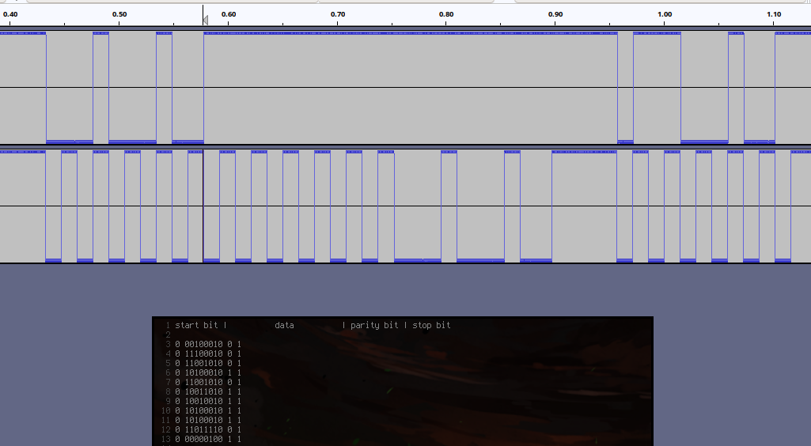

ASCII UART
==========

**Category** : Hardware  
**Score** : 100 points  
**Solved** : 145 times  

---

>Un informateur a intercepté un message binaire transmis sur un câble. Il a rapidement enregistré via la carte son d'un PC les données en 8 bits signés (ascii_uart.raw). Dans la précipitation, il a oublié de noter la fréquence d'échantillonnage. Retrouvez le message.
>
>Le flag est de la forme DGSESIEE{X} avec X le message

---

### Files

 * [ascii_uart.raw](ascii_uart.raw) (0421ace2bbacbb5a812868b0dbb38a23533cda67bf7f00b1031fdbd7a228c8a5)

For this one, you need to look up the [UART protocol](https://en.wikipedia.org/wiki/Universal_asynchronous_receiver-transmitter#Data_framing). 

As a first step, we can load the file in Audacity (Import > Raw Data > Signed 8bit, Mono, sample rate doesn't really matter)


Zooming in on that first part, we can try to figure out the length of 1 bit, and isolate individual symbols. We find a start bit of 0, a stop bit of 1, and 9 bits inbetween, so we could assume the 9th bit is a parity bit.


*transcribing the first part by hand (2nd line is just a cut-and-pasted pseudo-clock signal to help me count bits)*

The parity bit theory mostly checks out for those first few chars - one of them has a parity error. When read LSB first, the 8 data bits turn out to be ASCII. Manually decoding, we get:

```
0 00100010 0 1 -> 0b01000100 -> 'D'
0 11100010 0 1 -> 0b01000111 -> 'G'
0 11001010 0 1 -> 0b01010011 -> 'S'
0 10100010 1 1 -> 0b01000101 -> 'E'
0 11001010 0 1 -> 0b01010011 -> 'S'
0 10011010 1 1 -> 0b01011001 -> 'Y' * parity mismatch
0 10010010 1 1 -> 0b01001001 -> 'I'
0 10100010 1 1 -> 0b01000101 -> 'E'
0 10100010 1 1 -> 0b01000101 -> 'E'
0 11011110 0 1 -> 0b01111011 -> '{'
0 00000100 1 1 -> 0b00100000 -> ' '
```

We expect a flag starting with "DGSESIEE{ ", so that Y is unexpected. However, it's also the one symbol with the parity error, so we'll assume all parity errors just have to be discarded.

There are too many bits in the rest of the message to do by hand, so I wrote a [script](ascii_uart.py) to help me parse the file directly:

```python3
#!/usr/bin/python3
import sys

file = sys.argv[1]
offset = int(sys.argv[2])
step = int(sys.argv[3])

bits = ''
with open(file, "rb") as f:
   f.seek(offset)
   while True:
       b = f.read(1)
       if not b: break
       if ord(b) < 0x80:
           bits += '1'
       else: 
           bits += '0'
       f.seek(step,1)

i=0
def dprint(msg):
   print("At offset %i: %s" % (i,msg))
   #print(bits[:i])
   #exit()

out = ''   
skipping = 3
while (i<(len(bits)-20)):

   start = int(bits[i],2)
   i += 1
   
   if (skipping == 0 and start == 1): 
       print("skipping")
       skipping = 1
   if (skipping == 1 and start == 0): skipping = 2
   if (skipping == 2 and start == 1): skipping = 3
   if (skipping == 3 and start == 0): skipping = 0
   if (skipping > 0): continue
   
   char = bits[i:i+8]
   i += 8
   
   parity = int(bits[i],2)
   i += 1
   if ((char.count('1') % 2) != parity):
       dprint("wrong parity for block %s (got %i)" % (char,parity))
   else:
      out += chr(int(char[::-1],2))
   
   stop = int(bits[i],2)
   i += 1
   if (stop != 1):
       dprint("stop bit not 1")
       
print(out)
```

It's a little rough. I attempted to make something that detects and skips over continuous chunks of no data, but it didn't work super well. Instead, I cheated a little by adding parameters to offset directly into the file and adjust sample rate. There's probably a much more robust way to write this, that could handle the whole file at once (and it's probably simpler than what I wrote...).

```bash
└─[$] ./ascii_uart.py ascii_uart_lastpart.raw 2 637
skipping
At offset 403: wrong parity for block 10111100 (got 0)
At offset 458: wrong parity for block 00000100 (got 0)
skipping
d[-_-]b  \_(''/)_/  (^_-)   @}-;---    (*^_^*)  \o/ }
```

It works out ok though, and we get the correct flag:

`DGESESIEE{ d[-_-]b  \_(''/)_/  (^_-)   @}-;---    (*^_^*)  \o/ }`

---

Before doing this. I didn't know much about the UART protocol besides that it's a thing that exists. I made the same mistake as in [Keypad Sniffer](../150_keypad_sniffer), where I saw a bunch of bits and figured I could work it out without having to look up anything.

There's probably some online UART decoder I could have used to be done with this in a second, but it was fun to work through.
