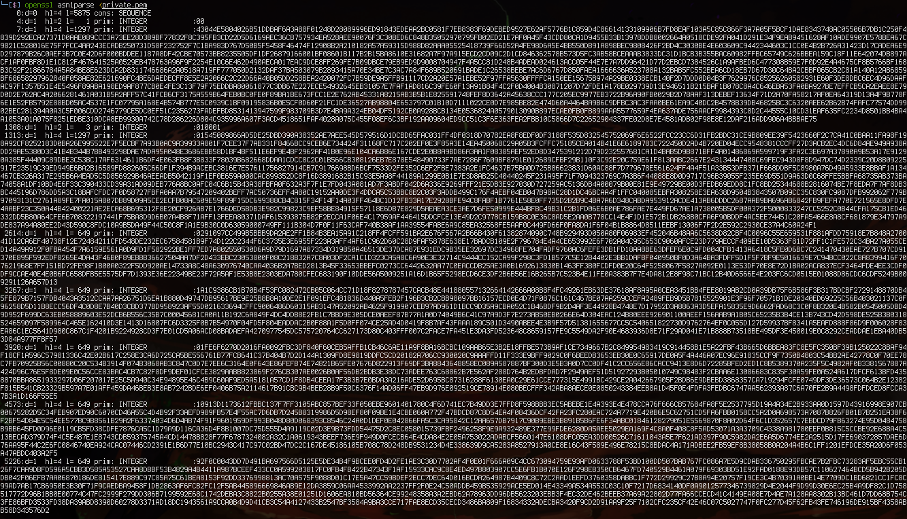

Stranger RSA
============

**Category** : Crypto  
**Score** : 200 points  
**Solved** : 60 times  

---

>Un de nos agents est parvenu à dérober une clé privée et un fichier chiffré à Evil Gouv. Retrouvez l'information, avec un peu d'imagination
>
>Le flag est juste une chaîne de caractères (sans le DGESIEE{})

---

### Files

 * [private.pem](private.pem) (84f2c60b3d796a01e7762777923a8921433bce8ead72bc94fa26d1676ecef637)
 * [EVIL-FILE.txt.enc](EVIL-FILE.txt.enc) (aee3dd5b398689bb73a207a52d56a130bca8fb30e3261e419ab22026b447b5ab)

Only an encrypted file and a private key ; Let's start by decrypting the file:

```bash
└─[$] openssl rsautl -decrypt -in EVIL-FILE.txt.enc -inkey private.pem 
221 x 7
```

Not much to go on, but this suggests that we may have to do something with a 221 by 7 grid later on. 
There's nothing else in the plaintext, so let's examine the private key a little closer:

```bash
└─[$] openssl rsa -text <private.pem
RSA Private-Key: (10375 bit, 2 primes)
modulus:
   43:04:4e:58:04:02:6b:51:dd:ba:f6:a3:a8:8f:01:
   24:8d:28:08:99:96:ed:91:84:3e:de:aa:2b:c0:58:
   1f:7e:b8:38:3f:69:de:be:d9:52:7e:62:af:57:76:
   b1:c8:59:d4:c8:66:14:13:31:09:90:6b:7f:d8:ea:
   f1:03:a5:c8:5c:86:6f:3a:7a:05:f5:bc:f1:da:e8:
...
```

10375bit private key? That's overkill, even for 2020. Something is up with those RSA parameters.



Nothing jumps out in hex, so let's see what we get in decimal:


Modulus and private exponent look fine, but the first prime is super suspicious. Resize the window a little:



And there's the flag.

---

(Interestingly, this is 223 x 7, not 221 x 7. Not sure what's up with that. It might be a mistake, or it might be that the message shows up better in a different decoding that fits precisely in 221x7, but is still readable directly in decimal).

---

Neat idea. I got lucky, though, I think. I bet this challenge could be really frustrating if you accidentally miss the correct way to look at the numbers.
